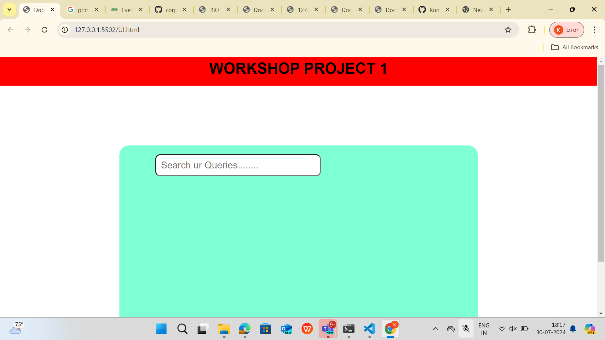
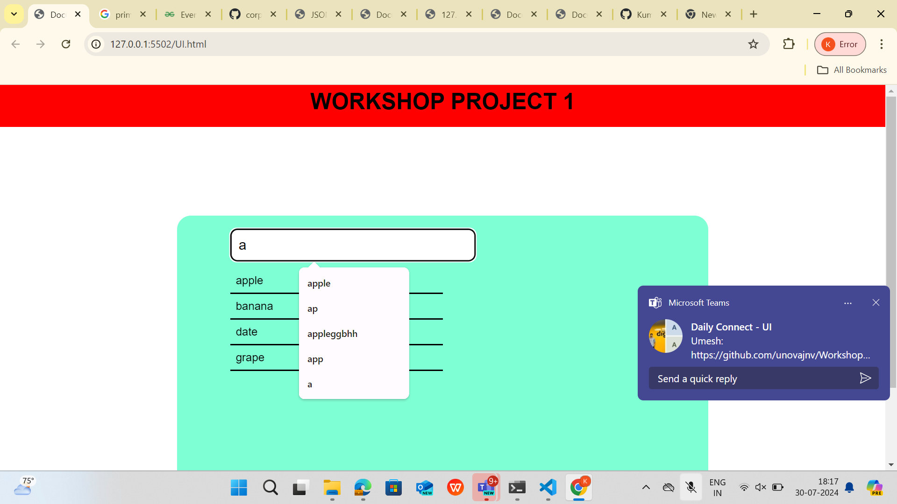
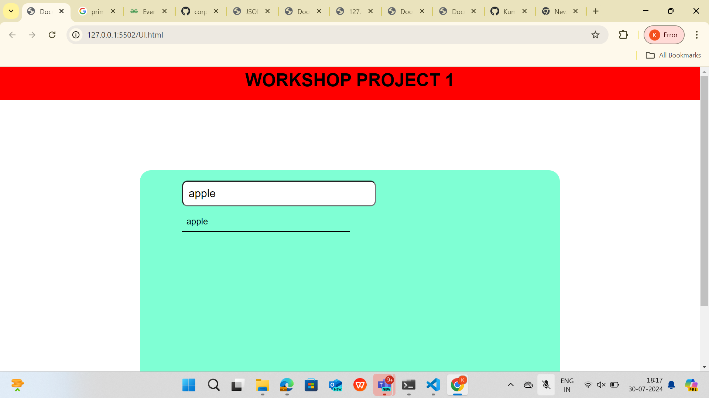

Build a dynamic search feature using jQuery and AJAX.
 When the user types into the search bar, send an AJAX request to fetch search results ,
 and display them below the search bar in real-time. 
 Implement debouncing to limit the number of requests sent.

1. ISt landing page output

 

 3. During search in searchbar  output
 

4. final output after giving input in search bar

